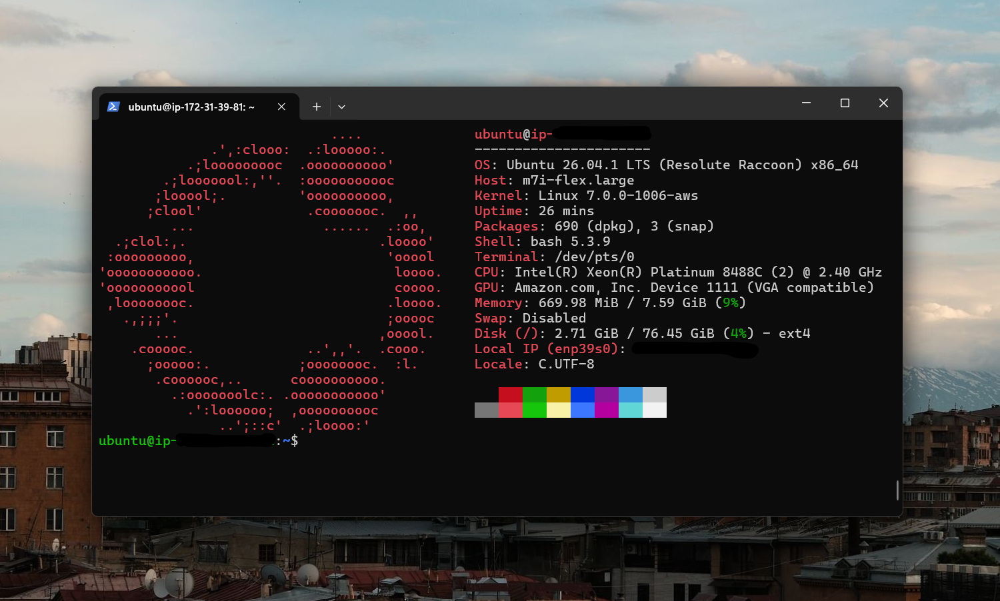
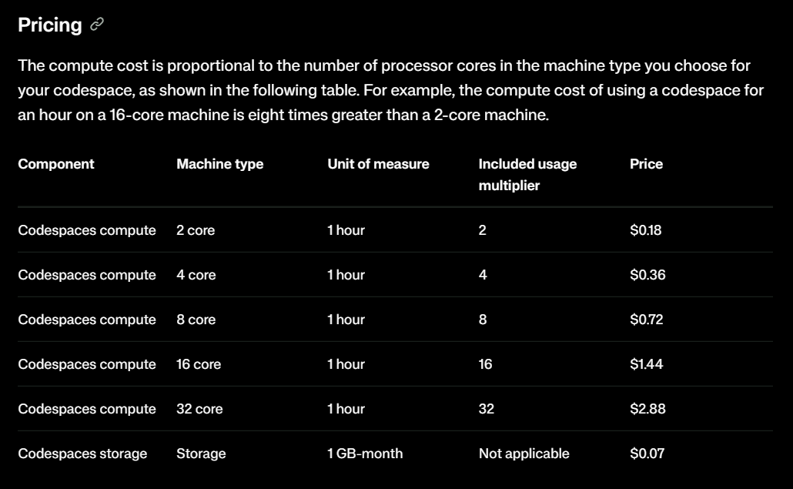
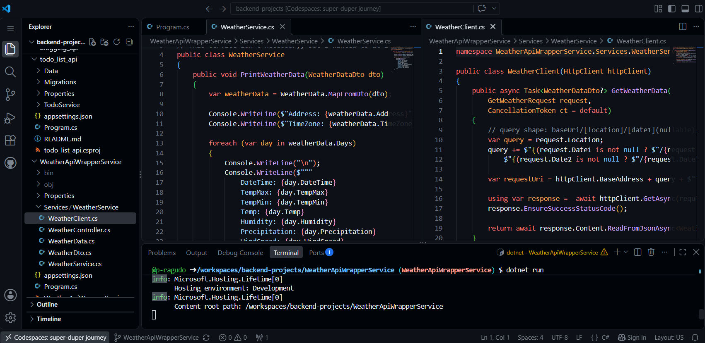

You might be thinking: why not just use your local machine? I have my own laptop, and I have VS Code, IntelliJ, and Android Studio installed. 
And you’d be right to think that. So why did I move my development environment to the cloud? 
Here, I discuss of how exactly I came to that decision, where I was in my learning journey when I decided to fully move to the cloud, and my experience so far.

---

## My Laptop is old and slow
The first pain point that I had encountered was my old laptop became bloated and slow. There are a large number of old leftover applications that were not deleted 
upon uninstallation, a ton of background processes that takes up 80-85% of memory even on idle, and many more that took up a bit of space in my device.

Many  times I manually deleted old and unused files, used Window’s built in disk clean up program, searched which background processes can be turned off and deleted, 
and more things that I probably forgot to mention.

But however I try to do some cleanup, my laptop never seemed to perform faster. And that is an issue when I’m writing software. Many times I would start VS Code, 
and I would have to manually wait around at least 5 minutes before I can get into writing code. And that is only on startup. When writing code, 
I would suffer very slow performance even to the point of just simply writing text is a pain. And that was very weird, since VS Code is a lightweight editor, 
it’s not exactly a heavy program by any means. 

### Battery drains fast, and cooling fan starts humming loudly

Another issue I had with is my battery drains fast. Now, relatively, running VS Code and an ASP.NET Web API is not exactly what you would describe as a heavy workload, 
but when I’m carrying my laptop around, finding spots in cafes where a spot with an outlet nearby is a hit or miss, battery life is everything. I’ve had to really minimize 
the workload I put on my laptop to try to save as much battery as possible.

The fan is also an issue. My fans are clean, but I cannot think of any reason why even on light workloads, it would hum loudly. Maybe I just don’t have much experience 
or knowledge about the inner workings that I can’t tell why, but it was very weird. Where I live, it is also very hot, so my device can heat up pretty quickly, 
and I’m consistently trying to avoid those situations.

But a slow device and a fast-draining battery was the least of my options. Of course I could choose to clean up my device more, find the root cause of slow performance and a loud fan,
but I didn’t really feel like doing those things. And as I mentioned, I also had other reasons that had a way bigger impact on my decision to go fully cloud.

## I wanted to use Linux and mirror production environments

I use Windows as my daily driver. Yes, I like Linux, but I like Linux for development, its environment, its terminal, and the like. As a daily driver outside writing software, 
I would rather use Windows.

When deploying projects, it will almost always certainly be on a Linux machine, or in a container with a base Linux image. And I wanted my dev environment to mirror this as closely as possible: 
accessing remote servers, deploying my projects, navigating a bash terminal, file systems, etc. I wanted to get that experience that I couldn’t just fully get on Windows. 

The machines I’m working on are usually Ubuntu, with 2 vCPU and 8GB of RAM, and I’m left with around 7GB of RAM on idle. That is almost a whole 7GB of RAM dedicated solely for development 
and running applications, compared to my 8GB Windows laptop that has to run a ton of other background processes that takes up 70-80% of memory on idle.

I’ve tried WSL before, and it was really great! But I can only allocate so much RAM and swap memory on my 8GB machine. Plus, I would still be running that workload locally, which caused 
a few problems I mentioned before.

What’s also great was when I was considering my options, it led me to an entire rabbit hole of looking into Virtual Private Servers (VPS), introduced me to SSH, Tailscale, nginx, 
nd many other tools that I would’ve never had a chance to look into if I had stayed coding locally. Because of this, I gained a bit more understanding of the “cloud”, and that they are 
really just physical machines running somewhere in the world, and how applications, websites, and services run on these physical machines.

## GitHub Student Developer Pack and GitHub Codespace

And now we also get to one of the main reasons that really pushed me to go fully cloud. GitHub Codespace offers 120 core hours per month for free, or around 60 hours when running a 2 core 8GB RAM machine. 
Now, 60 hours per month does not sound that much. If you’re coding at least 4 hours a day, that is around 120 hours on a 30-day month, double the free hours they offer.

### GitHub Student Developer Pack

I’m still a student, and so I applied for the Student Developer Pack, and that gives me access to the Free Quota for the Pro Plan. The Pro Plan gives you 180 core hours per month for free, or around 90 hours when running 
a 2 core 8GB RAM machine. In my specific use case, I’ve never had any issues and I’ve never really exceeded that quota. Even if I did, I would be okay with their hourly-based pricing, which again would only amount to an excess 
of a few hours from the free quota.

## Portability

Another big reason is the portability it gives me. I could login to GitHub from any device — a pc, a laptop, a tablet — anywhere in the world. And as long as I have a browser and an internet connection, 
I would have a whole dev environment with me. I can also add a .devcontainer to a repo and I would have custom settings be setup for me during bootup.

This gives me a bit of freedom, as I also hate bringing my laptop when I’m roaming or when going to university, since it’s a nightmare when I’m commuting. I really have to be mindful and careful 
of how I move and how I sit during commutes. And because I’m a broke college student with no job as of now, I cannot afford to break my one device I use to learn development and to do my course work. 

Not having to bring my laptop to school or during commutes is a huge plus for me, since our campus has computers that I can readily use. I could just login to my GitHub account, open a codespace on any repo, 
and I would be setup and good to go.

---

## The downsides

Of course, it also came with a lot of cons and downsides with my new setup. But these are tradeoffs that I considered when making the decision to go fully cloud.

### Slow or no internet access

The most obvious one is this. What do I do when there is no available internet connection, or a slow signal or Wifi?

I’ve never really encountered this issue much. I always try to find spots and go to computer labs that have great reception. But this is a real downside nonetheless. 

### Limited IDE options

VS Code is a lightweight text editor that lacks the complete features of what makes an IDE. My options for editors become very limited, and IDEs such as IntelliJ and Visual Studio do not fully support remote browser-based setups.

You cannot also build native apps with Swift or Flutter, as they require IDEs such as XCode or Android Studio, although React Native is a very good alternative if you’re fine with going that route. 

However, this will rarely be an issue for me, since my main focus is on web and the cloud, so that’s another tradeoff I’m willing to make.

---

## My experience so far

Apart from minor hiccups here and there, my general experience has been great! The ability to just log in on any browser and spin up a dev environment has been a really good experience for me so far, and I don’t plan on changing that anytime soon. 
It’s also great that I do not have to install any SDKs, runtime, or global packages on my local machine.

I also really like working on a UNIX environment. Given my goals of doing backend, systems, and cloud, having a UNIX system as my daily driver for programming really helps me be familiar and slowly build expertise. Also, compared to 
using Windows cmd or PowerShell, it’s just really nice!

---

## Conclusion

While I decided that moving fully cloud was the better option for me, it may not mean that it is also the best option for you. We all have different situations, use-cases, and personal preferences, and that is fine. A lot of these problems I encountered 
are specific to me, and they may not mostly apply to you, if at all. 

But if you’re also interested in learning backend, cloud, distributed systems, Linux, and other similar areas, I encourage you to explore these kinds of setups. Spin up a remote VM, harden SSH, deploy your applications, break things, and the like. 
It’s fun, and it makes you a better developer!